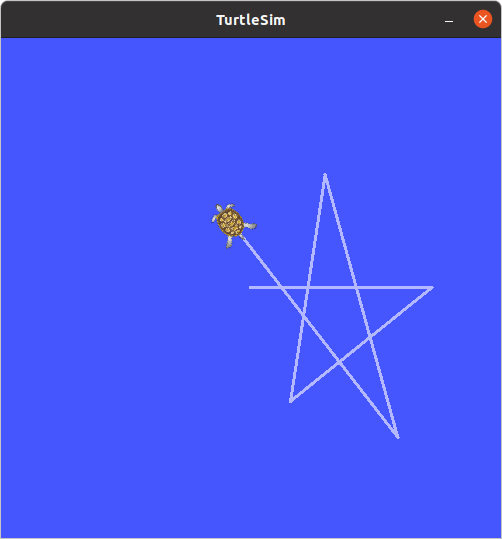
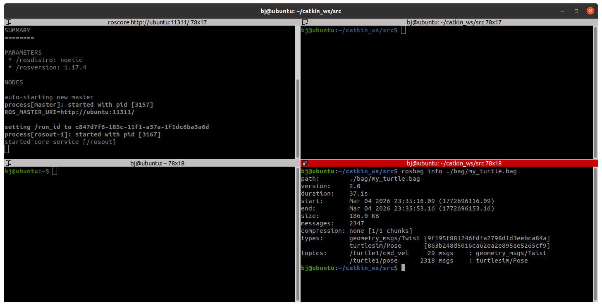
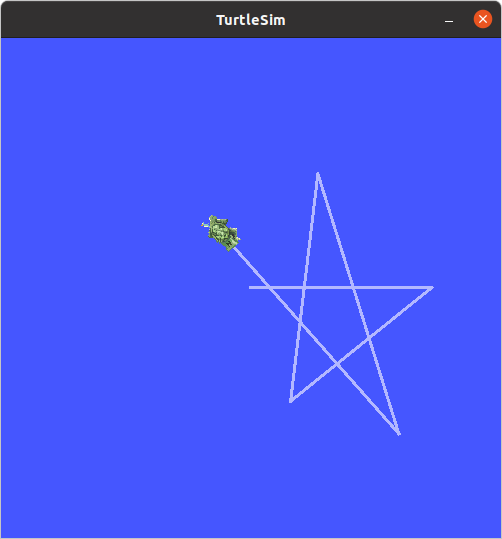
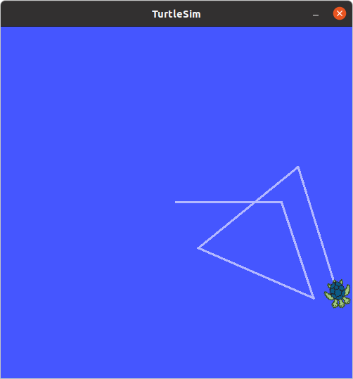
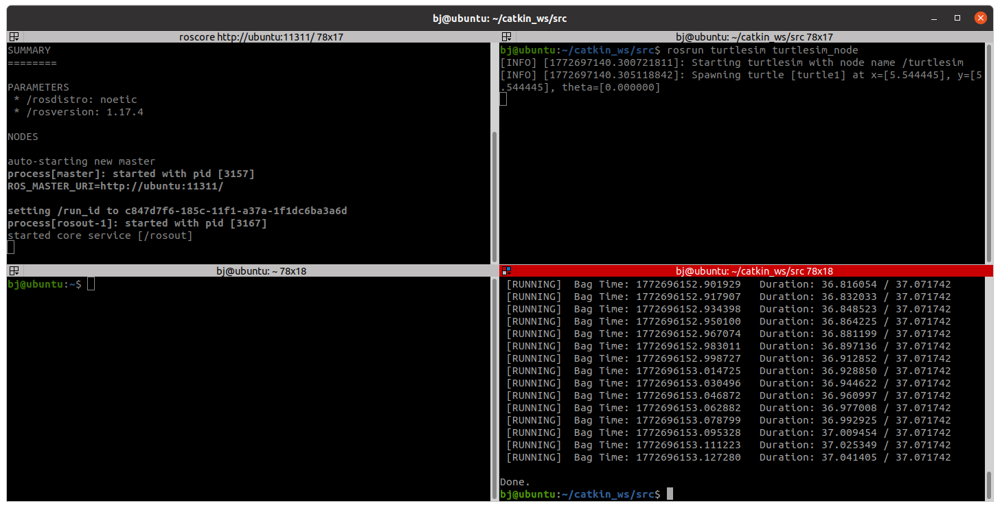
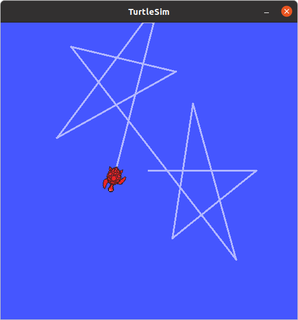
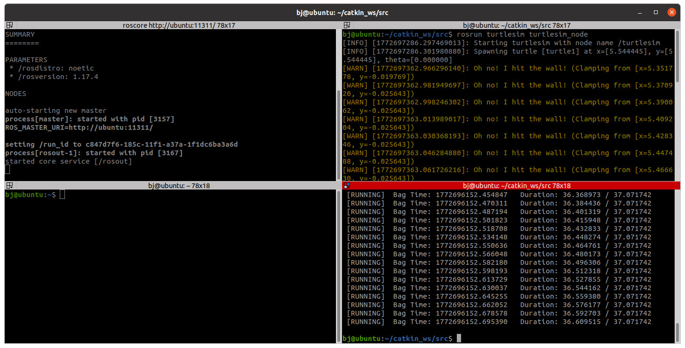

# Day 3 실습 결과
## 용도:토픽이름
- 속도 명령     : /turtle1/cmd_vel
- 거북이 위치   : /turtle1/pose

## rosbag record
```bash
rosbag record -O my_turtle /turtle1/cmd_vel /turtle1/pose
```
<!-- 여기에 기록 중 거북이 경로 스크린샷을 넣으세요 -->


## rosbag info
```bash
rosbag info ./bag/my_turtle.bag 
```



## rosbag play

```bash
rosbag play ./bag/my_turtle.bag
```
<!-- 여기에 재생 결과 스크린샷을 넣으세요 -->



```bash
rosbag play -r 2 ./bag/my_turtle.bag 
```
<!-- 여기에 재생 결과 스크린샷을 넣으세요 -->



```bash
rosbag play -l ./bag/my_turtle.bag 
```
<!-- 여기에 재생 결과 스크린샷을 넣으세요 -->



## 재생 데이터를 Subscriber로 수신
### 토픽 메시지 타입 확인
```bash
rostopic type /turtle1/pose
```
turtlesim/Pose
```bash
rosmsg show turtlesim/Pose
```
float32 x 

float32 y 

float32 theta 

float32 linear_velocity 

float32 angular_velocity 